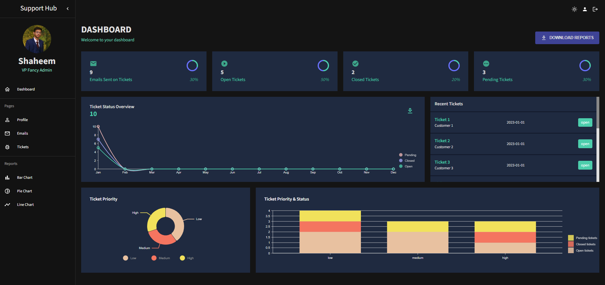
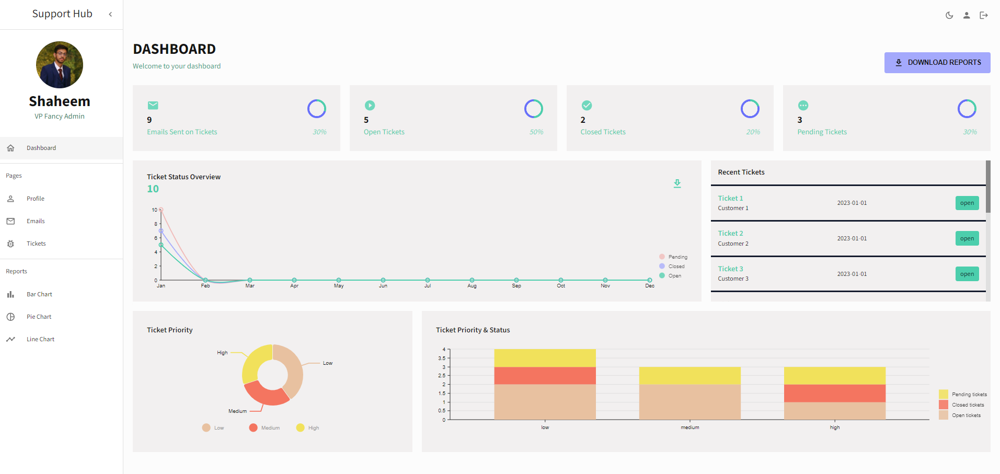
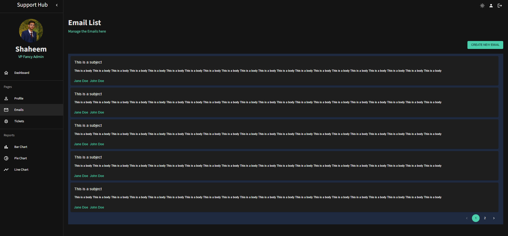
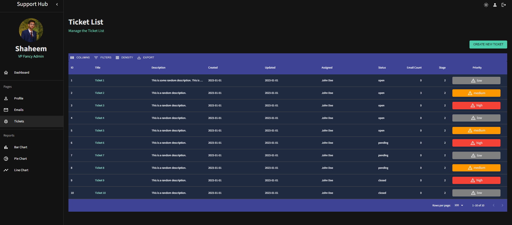
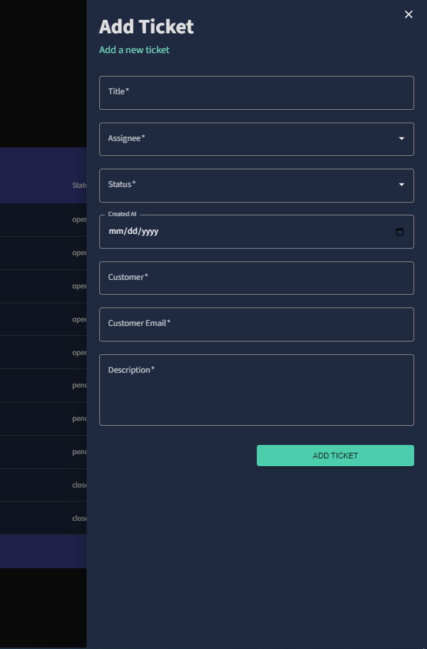

# Project Title  
Admin Dashboard

# Table of contents  
1. [Project Title](#project-title)
2. [Table of Contents](#table-of-contents)
3. [Screenshots](#screenshots)
    - [Dashboard](#dashboard)
    - [Dashboard Light](#dashboard-light)
    - [Email List](#email-list)
    - [Ticket List](#ticket-list)
    - [Add Ticket](#add-ticket)
4. [Tech Stack](#tech-stack)
5. [Description](#description)
6. [Features](#features)
7. [Run Locally](#run-locally)
8. [Feedback](#feedback)

## Screenshots  

### Dashboard

### Dashboard Light

### Email List

### Ticket List

### Add Ticket

## Tech Stack  

**Client:** React, MaterialUI  

## Description

Welcome to the Admin Dashboard Repository – a powerful and intuitive tool for managing and monitoring your system. This admin dashboard provides a seamless experience with three main pages: Profile, Emails, and Tickets. Dive into a comprehensive set of features that allow you to perform CRUD operations effortlessly.

## Features  

- Ticket Management: Perform Create, Read, Update, and Delete operations with ease.
- Email Management: Seamlessly handle your emails and streamline communication.
- Dashboard Insights: Gain valuable insights with graphical representations, including recent tickets and various statistics related to ticket activities.
- Graphical Analysis: Explore a variety of graphs such as Bar, Line, and Pie charts for a visual representation of data trends.
- User-Friendly Interface: Navigate through the dashboard effortlessly, with all pages conveniently listed on the sidebar.
- Top Bar Functionality: The top bar provides options to logout and switch between dark and light modes for a personalized experience.
- Login Screen: Secure access with a user-friendly login screen, ensuring data protection.

## Run Locally  

Clone the project  

~~~bash  
  git clone https://github.com/shaheemnaseeb/admin-dashboard.git
~~~

Go to the project directory  

Install dependencies  

~~~bash  
npm install
~~~

Start the server  

~~~bash  
npm run start
~~~

## Feedback  

If you have any feedback, please reach out to us at shaheemnaseeb@gmail.com
